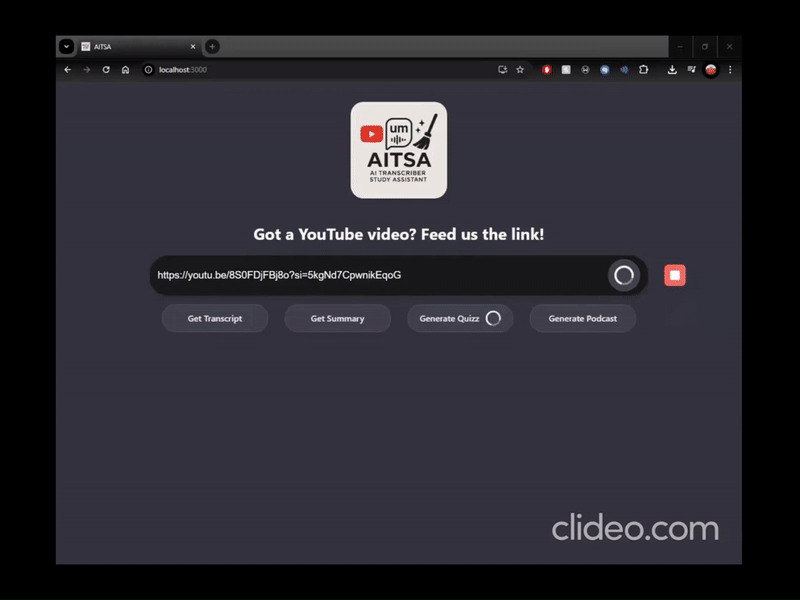
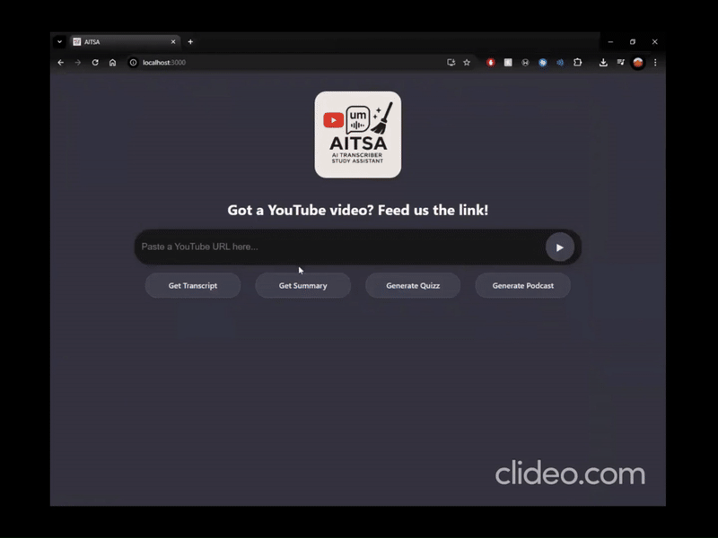
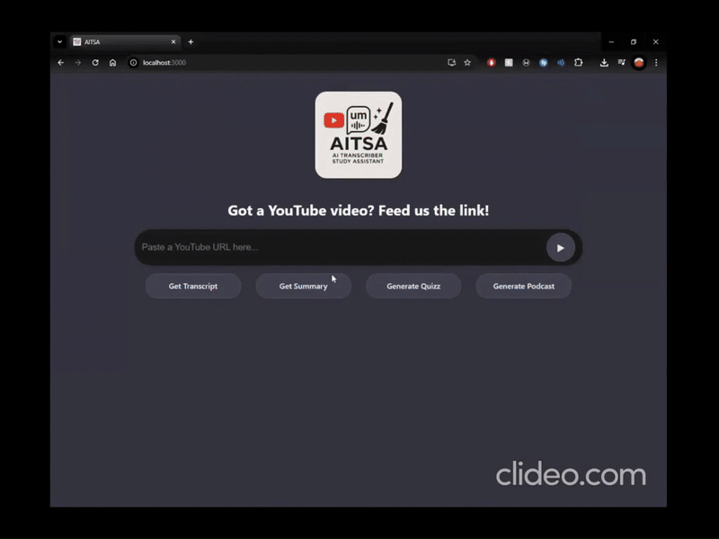
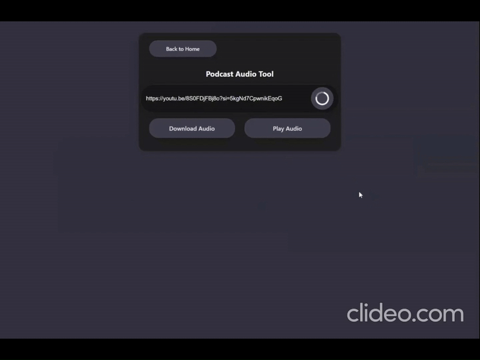

# LXThon AITSA Artificial Intelligence Transcript Study Assistant 

*An educational assistant tool leveraging YouTube videos to aid in learning and comprehension.*

This monorepo includes:
- **Backend**: Spring Boot service for transcript extraction, cleaning, summaries, quizzes, and podcast generation.
- **Frontend**: React application to interact with all features via a user-friendly UI.

---

## Prerequisites

### Backend
1. **Java 21** (check with `java --version`).
2. **Maven** (for building).
3. **yt-dlp** installed and on your system `PATH`:
   ```bash
   # macOS (Homebrew)
   brew install yt-dlp

   # or via pip
   pip install yt-dlp

   yt-dlp --version
   ```
4. A valid **OpenAI/GitHub AI API key** (set in `.env`).

### Frontend
1. **Node.js** (v16+).
2. **npm** or **yarn**.

---

## Configuration

### Environment Variables

#### Backend `.env`
From GitHub MarketPlace, select an AI Model.

```dotenv
OPENAI_API_KEY=your_api_key_here
```
Location: project root.

From elevenLabs

```dotenv
ELEVEN_LABS_API_KEY=your_api_key_here
```
---

## Build & Run

## Backend

### Setup & Run

1. Clone the repo and `cd backend`
2. Create a `.env` file (see above)
3. Build and run:
   ```bash
   mvn clean package
   mvn spring-boot:run
   ```
4. The server will start on `http://localhost:8080`.
---

## REST API (Backend)

Base path: `/api/videos`

#### Video / Transcript / Quiz

| Method | Path                           | Query / Body                     | Description                                           |
| ------ | ------------------------------ | -------------------------------- | ----------------------------------------------------- |
| GET    | `/api/videos/info`             | `?url={videoUrl}`                | Returns raw YouTube video metadata (JSON).            |
| GET    | `/api/videos/transcript`       | `?url={videoUrl}`                | Returns raw transcript segments.                      |
| GET    | `/api/videos/clean-transcript` | `?url={videoUrl}`                | Returns cleaned & normalized transcript segments.     |
| GET    | `/api/videos/summary`          | `?url={videoUrl}`                | Returns a concise summary of the transcript.          |
| GET    | `/api/videos/quiz`             | `?url={videoUrl}&numQuestions=5` | Returns a multiple-choice quiz (default 5 questions). |


#### Podcast

Base path: `/podcast-api/chat`

| Method | Path                    | Params / Body     | Description                                                                                                                                           |
| ------ | ----------------------- | ----------------- | ----------------------------------------------------------------------------------------------------------------------------------------------------- |
| POST   | `/completion`           | Raw text body     | Forwards a prompt directly to OpenAI; returns raw completion.                                                                                         |
| GET    | `/test-openai`          | —                 | Sends test prompt `"Say 'Hello World'..."` to verify OpenAI connectivity.                                                                             |
| POST   | `/test-save-audio`      | `?text={anyText}` | Uses TTS to generate a small MP3 file and saves it locally (for ElevenLabs / Azure TTS tests).                                                        |
| POST   | `/generate-podcast`     | `?url={videoUrl}` | Generates podcast script & audio from a YouTube URL. Returns JSON with:• `podcastId`• `script`• `hosts`• `audioSizeBytes`• `downloadUrl`• `streamUrl` |
| GET    | `/download/{podcastId}` | Path param        | Streams the generated MP3 as an attachment download.                                                                                                  |
| GET    | `/stream/{podcastId}`   | Path param        | Streams the generated MP3 inline for playback.                                                                                                        |
| POST   | `/clear-cache`          | —                 | Clears the in-memory podcast cache (useful for testing).                                                                                              |

---
## Frontend

### Setup & Run

1. `cd frontend`
2. Copy `.env.example` to `.env` and set:
   ```env
   REACT_APP_API_URL=http://localhost:8080
   ```
3. Install and start:
   ```bash
   npm install
   npm start
   ```
4. Open `http://localhost:3000` in your browser.

---

### User Flow

- **Home**: Paste a YouTube URL, then click

   - **Get Transcript** → view cleaned transcript
   - **Get Summary** → view AI-generated summary
   - **Generate Quiz** → answer a 5-question quiz
   - **Generate Podcast** → convert video into podcast audio

- **Transcript Page** (`/transcript`): Displays time-coded transcript.



- **Insights Page** (`/insights`): Shows AI-generated summary.



- **Quiz Page** (`/quiz`): Interactive multiple-choice quiz, shows score.



- **Podcast Page** (`/podcast`):

   - Enter URL → generate podcast
   - Download or play audio in-browser



---

## Contributing

1. Fork the repo and create a feature branch.
2. Write tests for new functionality.
3. Submit a pull request with clear description.

---

## Project Structure

```
backend/
  ├─ src/main/java/…
  │   ├─ config/          (.env loader, CORS, OpenAIConfig)
  │   ├─ Controller/      (VideoController, PodcastController)
  │   ├─ Domain/          (TranscriptSegment, Quiz, QuizQuestion)
  │   ├─ Service/         (VideoService, TranscriptCleanerService, SummaryGeneratorService, QuizGeneratorService, PodcastService, OpenAIService, etc.)
  │   └─ Main.java        (SpringBootApplication, async enabled)
  └─ .env                 (your API key)
frontend/
  ├─ src/components/     (HomePage, TranscriptPage, InsightsPage, QuizPage, PodcastPage)
  ├─ src/services/       (transcriptService.js, insightsService.js, quizService.js, podcastService.js)
  └─ src/routes/         (React Router setup)
  
```
---

## Notes

- All AI calls use **temperature=0** for deterministic outputs.
- The quiz generator & summarizer use prompt engineering to keep outputs JSON-parsable.
- Make sure `yt-dlp` is on your PATH so subtitle extraction works.
- This tool is designed to **aid studying**: extract knowledge from videos, test yourself, and even listen on the go as a podcast.

## Future Improvements
- Support multiple languages for transcripts and quizzes.
- Add user authentication and saved sessions.
- UI enhancements: progress bars, feedback.

---

## License

AITSA - Study Assistant © 0days

Enjoy learning! 🚀